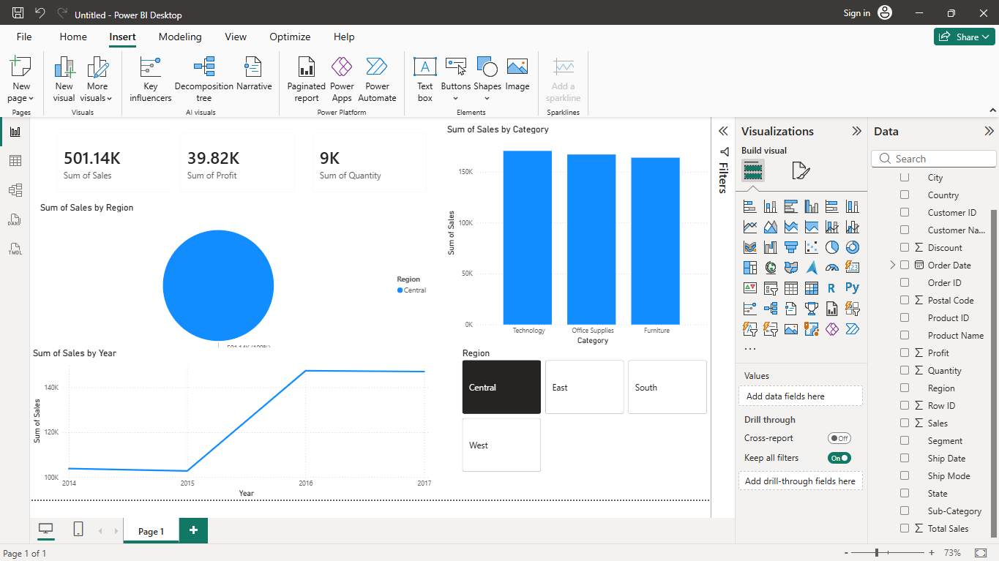

# Deep-Dive Analysis & Interactive Dashboarding

## 📌 Internship Task
This project was completed as part of the Data Analytics Internship at ApexPlanet Software Pvt. Ltd.

---

# 📊 Project Overview
The objective of this project is to perform deep-dive business analysis and build an interactive Power BI dashboard to visualize sales performance, profit trends, and regional analysis.

The dashboard helps in understanding key business insights and supports data-driven decision-making.

---

# 🛠️ Tools & Technologies Used
- Power BI
- Python
- Pandas
- Excel / CSV Dataset
- Data Visualization Techniques

---

# 📂 Dataset Used
Superstore Sales Dataset

The dataset includes:
- Sales Information
- Profit Details
- Product Categories
- Customer Details
- Regional Data
- Order Dates

---

# 🎯 Key Performance Indicators (KPIs)

The following KPIs were analyzed:

| KPI | Description |
|-----|-------------|
| Total Sales | Overall revenue generated |
| Total Profit | Total profit earned |
| Total Orders | Number of orders placed |
| Average Sales | Average sales value |
| Profit Margin | Profit percentage from sales |

---

# 📈 Dashboard Visualizations

The interactive dashboard includes:

- KPI Cards
- Sales by Category Bar Chart
- Region-wise Sales Pie Chart
- Monthly Sales Trend Line Chart
- Profit vs Sales Scatter Plot
- Interactive Filters (Slicers)

---

# 🔍 Deep-Dive Analysis

Performed detailed analysis on:
- Regional Sales Performance
- Profitability Trends
- Category-wise Sales Analysis
- Monthly Revenue Trends

### Key Findings
- Western region generated the highest sales.
- Technology category contributed maximum revenue.
- Higher discounts negatively impacted profit.
- Sales showed positive growth trend over time.

---

# 🎛️ Interactive Features

The dashboard includes:
- Region Filters
- Category Filters
- Dynamic Visual Interactions
- Drill-down Analysis

These features help users explore insights interactively.

---

# 📁 Project Files

- `dashboard.pbix` → Power BI Dashboard File
- `sales.csv` → Dataset
- `screenshots/` → Dashboard Screenshots
- `report.docx` → Deep-Dive Analysis Report
- `README.md` → Project Documentation

---

# 🚀 Skills Gained

Through this project, I improved skills in:
- Power BI Dashboard Development
- Business Intelligence
- KPI Analysis
- Data Visualization
- Analytical Thinking
- Interactive Reporting

---

# 📸 Dashboard Preview

(Add your dashboard screenshot here)

# 🔗 Internship
Completed as part of the Data Analytics Internship Program at ApexPlanet Software Pvt. Ltd.

---

# 👨‍💻 Author
SYAMBABU AKUMARTHI